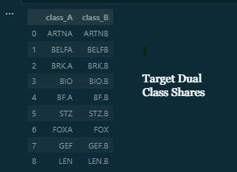

<a name="readme-top"></a>

<!-- PROJECT SHIELDS -->
<!--
*** I'm using markdown "reference style" links for readability.
*** Reference links are enclosed in brackets [ ] instead of parentheses ( ).
*** See the bottom of this document for the declaration of the reference variables
*** for contributors-url, forks-url, etc. This is an optional, concise syntax you may use.
*** https://www.markdownguide.org/basic-syntax/#reference-style-links
-->

[![Contributors][contributors-shield]][contributors-url]
[![Forks][forks-shield]][forks-url]
[![Stargazers][stars-shield]][stars-url]
[![Issues][issues-shield]][issues-url]
[![MIT License][license-shield]][license-url]
[![LinkedIn][linkedin-shield]][linkedin-url]

<!-- PROJECT LOGO -->
<br />
<div align="center">
  <a href="https://github.com/Shivamkak19/Dual-Class-Arbitrage-Algorithm">
    
  </a>

<h3 align="center">Project Description</h3>

This algorithm takes advantage of an arbitrage between certain dual-class shares that hold nearly identical market caps. Specifically, it identifies price discrepencies between publicly-traded shares in a dual-class structure and simultaneously marks both a short and a long position (for an example of dual-class structure, Google Class A: GOOG vs Google Class B: GOOGL, Berkshire Hathaway Class A: BERK.A, Berkshire Hathaway Class B: BERK.B). The underlying assumption is that the similar market caps of the dual-class shares will eventually drive share prices to converge, meaning either the long or the short will be able to return a profit. 

Notes: I have hard-coded a list of popular dual-class shares in "shares.csv". This list can be adjusted to preference. Additionally, an account is recognized as a Pattern Day Trader if it makes 4 day trades in a 5 day period with an account balance < $25,000. For learning purposes, the scheduler is only set up to run trades within this strict limit.  

*C# implementation is still in development. Instructions for the Python implementation are listed in sections below. 

<br />

<a href="https://github.com/Shivamkak19/Dual-Class-Arbitrage-Algorithm/images">View Product</a>
·
<a href="https://github.com/Shivamkak19/Dual-Class-Arbitrage-Algorithm/issues">Report Bug</a>
·
<a href="https://github.com/Shivamkak19/Dual-Class-Arbitrage-Algorithm/issues">Request Feature</a>
</div>

<!-- TABLE OF CONTENTS -->
<details>
  <summary>Table of Contents</summary>
  <ol>
    <li>
      <ul>
        <li><a href="#built-with">Built With</a></li>
      </ul>
    </li>
    <li>
      <a href="#getting-started">Getting Started</a>
      <ul>
        <li><a href="#prerequisites">Prerequisites</a></li>
        <li><a href="#installation">Installation</a></li>
      </ul>
    </li>
    <li><a href="#usage">Usage</a></li>
    <li><a href="#roadmap">Roadmap</a></li>
    <li><a href="#contributing">Contributing</a></li>
    <li><a href="#license">License</a></li>
    <li><a href="#contact">Contact</a></li>
    <li><a href="#acknowledgments">Acknowledgments</a></li>
  </ol>
</details>


### Built With

* [![Alpaca-Py][alpaca-py]][alpaca-py-url]
* [![Darqube][darqube]][darqube-url]
* [![Scheduler][scheduler]][scheduler-url]
* [![Pandas][pandas]][pandas-url]
* [![Streamlit][streamlit]][streamlit-url]


<p align="right">(<a href="#readme-top">back to top</a>)</p>

<!-- GETTING STARTED -->
## Getting Started

Below, the set-up process is listed to run this project on your local machine. Note, the C# implementation is not yet live. Instructions for the Python implementation are included below. 

### Prerequisites

To run this project, you must download the latest version of the pip installer

* pip
  ```sh
  pip install --upgrade pip
  ```

### Installation

1. Clone the repo
   ```sh
   git clone https://github.com/Shivamkak19/Dual-Class-Arbitrage-Algorithm.git
   ```

2. Switch to py folder
   ```sh
   cd py
   ```

3. Install dependencies
   ```sh
   pip install -r requirements.txt
   ```

<p align="right">(<a href="#readme-top">back to top</a>)</p>

<!-- USAGE EXAMPLES -->
## Usage

This project was designed as a learning project for the purpose of exposure into the process of developing trading algorithms. Any usage must be compliant with Pattern Day Trading rules, and failure to comply to these standards will result in the user's Alpaca client being flagged and banned. Feel free to tinker with this algorithm and explore. Do make sure to replace the dummy text with your unique Client ID and secret key. 

<!-- ![Product Name Screen Shot][product-screenshot2]
![Product Name Screen Shot][product-screenshot3] -->

<p align="right">(<a href="#readme-top">back to top</a>)</p>

<!-- ROADMAP -->
## Roadmap

- [ ] Designate target dual-class shares
- [ ] Authenticate Alpaca API with Client ID and secret
- [ ] Perform HTTP GET/POST requests to fetch information from Alpaca Trading Client
    - [ ] Set up functionality to order long position, short position, sell open positions, and cancel pending positions
- [ ] Perform GET requests to Darqube API for live share pricing information
- [ ] Create algorithm for margins at which to buy/sell short and long positions
- [ ] Liquidate all holdings 5 minutes before closing bell
- [ ] Set up Python Scheduler to send necessary API calls every 30 sec, open hours, Mon - Fri
- [ ] Create simple user interface to manage holdings via Streamlit

See the [open issues](https://github.com/Shivamkak19/Dual-Class-Arbitrage-Algorithm/issues) for a full list of proposed features (and known issues).

<p align="right">(<a href="#readme-top">back to top</a>)</p>

<!-- CONTRIBUTING -->
## Contributing

If you have a suggestion that would make this better, please fork the repo and create a pull request. You can also simply open an issue with the tag "enhancement".
Don't forget to give the project a star! Thanks again!

1. Fork the Project
2. Create your Feature Branch (`git checkout -b feature/newFeature`)
3. Commit your Changes (`git commit -m 'Add some new feature to Dual-Class-Arbitrage-Algorithm'`)
4. Push to the Branch (`git push origin feature/newFeature`)
5. Open a Pull Request

<p align="right">(<a href="#readme-top">back to top</a>)</p>

<!-- LICENSE -->
## License

Distributed under the MIT License. See `LICENSE` for more information.

<p align="right">(<a href="#readme-top">back to top</a>)</p>


<!-- CONTACT -->
## Contact

* Shivam Kak: sk3686@princeton.edu
* Project Link: [https://github.com/Shivamkak19/Dual-Class-Arbitrage-Algorithm](https://github.com/Shivamkak19/Dual-Class-Arbitrage-Algorithm)

<p align="right">(<a href="#readme-top">back to top</a>)</p>


<!-- ACKNOWLEDGMENTS -->
## Acknowledgments

* []() Adam Hayes, Investopedia contributor, for a thorough explanation of dual-class shares and arbitrage.
* Article Link: [Investopedia Article](https://www.investopedia.com/terms/d/dualclassstock.asp)

<p align="right">(<a href="#readme-top">back to top</a>)</p>


<!-- MARKDOWN LINKS & IMAGES -->
<!-- https://www.markdownguide.org/basic-syntax/#reference-style-links -->
[contributors-shield]: https://img.shields.io/github/contributors/Shivamkak19/Dual-Class-Arbitrage-Algorithm.svg?style=for-the-badge
[contributors-url]: https://github.com/Shivamkak19/Dual-Class-Arbitrage-Algorithm/graphs/contributors
[forks-shield]: https://img.shields.io/github/forks/Shivamkak19/Dual-Class-Arbitrage-Algorithm.svg?style=for-the-badge
[forks-url]: https://github.com/Shivamkak19/Dual-Class-Arbitrage-Algorithm/network/members
[stars-shield]: https://img.shields.io/github/stars/Shivamkak19/Dual-Class-Arbitrage-Algorithm.svg?style=for-the-badge
[stars-url]: https://github.com/Shivamkak19/Dual-Class-Arbitrage-Algorithm/stargazers
[issues-shield]: https://img.shields.io/github/issues/Shivamkak19/Dual-Class-Arbitrage-Algorithm.svg?style=for-the-badge
[issues-url]: https://github.com/Shivamkak19/Dual-Class-Arbitrage-Algorithm/issues
[license-shield]: https://img.shields.io/github/license/Shivamkak19/Dual-Class-Arbitrage-Algorithm.svg?style=for-the-badge
[license-url]: https://github.com/Shivamkak19/Dual-Class-Arbitrage-Algorithm/blob/master/LICENSE
[linkedin-shield]: https://img.shields.io/badge/-LinkedIn-black.svg?style=for-the-badge&logo=linkedin&colorB=555
[linkedin-url]: https://linkedin.com/in/shivamkak
[product-screenshot]: images/product-1.jpg
[product-screenshot2]: images/product-2.jpg
[product-screenshot3]: images/product-3.jpg

<!-- Programming Language Shields -->
[pandas]: https://img.shields.io/badge/Pandas-e30487?style=for-the-badge&logo=pandas&logoColor=130654
[pandas-url]: https://pandas.pydata.org/

[scheduler-url]: https://pypi.org/project/scheduler/
[scheduler]: https://img.shields.io/badge/Scheduler-f4792b?style=for-the-badge&logo=data:image/png;base64,iVBORw0KGgoAAAANSUhEUgAAAEAAAABACAYAAACqaXHeAAATPklEQVR4nMSbC5xdVXXw/2ufe2cyiYTw+fgg4qMQi8UAYslMSFAQJDwKiq2IReWhoMirUAsEaYVYoBjKyygiRC0oYEVBUIsPID4QM0MSCGAEJYiIgDaiIclkZu45e/W3197nzrkzkzCPAAtuzp3z2Gettdd7rVvjRYDZZ99SW/of785nn33LdQofQDUHaqCChjs0/JuD1lCu7154+Ae7zryp1r3w8PyFxu1FYYAOHmuoClC3v7R5VVCtp7tqrU+9sPCiMCBscNf8m8LxOeAvoA2UKaCT0/Ve0A2JMc/NPuO/XyTyA+dHCbPP+Q5LLzjEjqAO1EMGeJZecGjLvV3zb447GDZbjBRnOy9uKyNaGQB9H+iiROmp4G8EacP7wIx1xjXFR0kQW6/7kve/NAyIRMf7RfpRbdPIhMxDEWn1w9Q1MMm5/5/l/g9FUvP0Rh+OemTQ9yTqH0D99RWVsKOvX4IbOL2WGOFLRgTovvSDLzwD0m6XtzoQL9IXGPBG0IdRJGhvwE29N/aggTFGoim5NmpIPZ+B6puB3YA3oLod8HrQ10Za9begjwNPo/or4AHQlUjfo/i2iIL34V1J8kRLJnVfdvQLw4BW4oOsSwEug+Jq4B+BvVC/AnFO840eV8+o1QoajVJku4B3g85D2Rm0PRFLifwQQ9h6TekH/QXoD1C+hffdtqwI+CJDtTAhk7hO9+XHbmkGfLtCfJBzeQXojcA7EoLrQQNhT0W8tSDL2sjz9wEfBea0ErgZYocTP9L5n6F6NSJfwxcD4AWVYFe8CUVgwhUfGjMD3CiuF8CbQO9OxA+gpvg3gG4MO+HVFyYVebEcuHaQeC2J/yPKD0E/DQQs9wYuMKaFtVS/Abwd9MMoF4PeCbqm8nxYa66trX45yJH43BQDLTK/4U+GbNepXxwzAzbnBrOkbwcCXwO2Tu7LRfOud6C6BtjZiVyC6oHxMc1RC3L+DNwKfBPVe4Bn7XLTjunOqGbpXeHaj9IngtdXIASi34PqIcC0tPZM0Otx9aNQ/hl0lUzZJlM1I6Gdpy6m5zPHbREGqP0n9ALtaTfKYCX8/xVgD4UTUJ0K5tokEf9Z0AtBnm41ourwmiGSoxq27d70zG8QyRI+RTKia4yBwq0o24N+FNVPxOsmOQeAdoOcrhSLgxHO3NjDms094ZP+/wTVo0DPB+P4ApS/BfOFZ1Z0tC2pRpCO7UCfNr9uxtPW8oj4GN6aGNwE3DT4OjtXdH38+vg9eJSggt4Hg/ck6LPJtQYpTK6ByaheI8hu4mpnKfQN6szEGQCSFeAdwk2ovx3celF9XGGFBuaoNkAnAUtRPg/6xSSm/xANoX7BQltx2v3p90Q2PXMIsm0wne9MMYFGeqeHc4cg079r93Wdfl1wryr5wIDW2mYDlybi68mW7K2q4XyQ0JNRvxbkX7ffen2te9UBuez8fXTVAYTj5mAzRlBR8++5D769PrUjWP3JHi5SDUlLsA9G/DX4YMC4zkQ/qkDQ5YeiNOBL4g362uI7B+oH0l+/goH6ZfTXo/3ob2vi033ZURGLrC6mXmpeIBD/c5T5WvhgNP8rRpbao8qVh898NPvxY68q2NiLPjQvPv+LeeOTAC1yVNptc1QLt2L+gX7m2bdclwxSI9mDfzPVyFTwLsPrBQj349uuxQ1QifuGMt2b1Vc9NZ0LwcP3KtdK8CmeXpFNzvYqevPTgLstIOqo9dPvj0WL+73yrWWrt3+qZ9Hx7Pa6Q8HVA9YWuAWt0Ifegcy8Y0Q6N+sGZYeDMUutms+cf8tFqAbR3mjEK2cinA9SC1pCdIXBcF2r+Q7l2sN1UZv+vTelwMEgbmi5NuSJsNaGR4JT4XJgmQhe+gtD0YlesWzVX/1W/+cIeOSAqfu/dmAJ7bULEvNqz6flIzIgJjPA6ltCBBiM1rtAzwpCCtqBciGOi00fzY+Ldi88vDRcmbQ9XNn5TcZaLuX/tZhXMAK/mszyk14zVZLEuqWXfyiFS15nbf/H+sIj7nD8cs/peHpA90EJ3mL/WHfIzNXqg/uNngHBpiUEw3teCVwdXY+2o9xK5s4xxNUMnpahebAaCkX3wvfaXnYvfC/GmBaaKhFeGfENCQpLCOFtjO483VccqyYtMeyzFCT4+0sPvjs/Y+6KcGp9DJ5sIY/yJdBpeB/TST+yYxi2PV3zv5lccS1DfIG6YGiOThnZw0wa2IW+NmlaSSP08JH5OALoY4fVZIdv5frYYQtAP5kQXiA73naern5nTXa8bdRVIH1of3C2T44NG5Qpk7cKKoKyQzCf5pnUn4hzGYUvwkbJrkta1hguASYxWUaeB9HuTMTnaXva2Fj/O7QocKJjdLkJ69FLwOjWsw1XJk8OsjgV1d+bSkWcPwKyK3nhLdBa0zvs8RYGdJ31DZg0yZaVqJafSkjGKE51BuhtIDdQ5LWxFFRaMY6vGJb4jIcD6iWhcTroA8A+URNDhBlCbV2Ay+KLpnWg9++zaQYYrN+Q4b3XmuyB6ry0VSEBWlMxSs9F/dfnS6ZGQLhyHKUEdJ70+eZx1smfbzlnG1OsC4u8EdgmSZhLuAU1PRQtdqHRX5BZOL4ZBkjCwtmzH4tnLFb/JuguwI2orqbQ01IiPtTHj50Dm5GAzpOuqhIfPYwfJnUeNyXgeBqqTwGPoOxveURkRmZ5RFYbTu+wQCikPvWOgkbfNOBdlTg/YPEMTo6k0GmIxdzDMR4r/U2Jar0WCDcIcYwljD7VJOxD54lX2uX9Fh/Cncd9O1p5YSPKflZVgrWp+nxYoiHEL/OhWB8rKoN4NznSdebXLfBkIMQkfj9UX5526UELPy32t/v/gpPmLgRXN04O6OBhkANN4k34XGZF5Ej4VKshCHsnUc3WD9Sri4aTDyOsNVydW4Lqr9PlbVH2oT+EMThd8VaGMWDIThxUQfBW1Y0xJPXeypndFx8x/qp1iwY0bYpRFFbXqUmHzfBKgW4XcAwJ/n3AJ1C9KMipxR+xnxDX8PbFmRT7QtAQwHFbWZoEPYgpG6LxrSjRkDgxJADOIbpnZfE7RCZjllUk7Lid7L74iC3AgQoTZvaw8qlFIs9JKe7h4oFI73lBQCultdmoHoRkt6E+k13uLCqLe1359oirWiU6pIIfT3ZsLnmH2NqV7atKQPwuvBp0h4TYs+Zaopj6sYt7K3Seco0t1XnqYjuGHfcmWMiub70/e8u+1zUS8W8GbgG93YqrWgYNVjk+DuVHaCGDjBoE2W1JjASLsJTeB8FjGfNmkE/aNhV63HAGmBgGvdMZKJPSC1fT6P2z1QQ0xpKxYDFeUKRm0awT58W1D+DawicvgrjPO3PRa4BFQcBAD4s1P3vtOtBPge4OfBF4DhlugJu6bQxDKPI/oaxOajDFmBBvkOEMCLq90MT6dRXxXE02OVVo0q0uGxfpnadcbcdfP7NNOPi1ffW+7ken+6WPTi8e/t+pHb19bSeu21i/z4obZX8wEv8lIBB+LuhfUpVqZDh+33jc/Snw4pLkrK7EG6+X3X8SvV2Cig1o6uZ2FRf1TEx3fY0s649bOPbYpwLutFvnBLHd6eDFBx+zrt96pG6r9oHTtpnc1154KRF11g8womNmFnF10RVK5M29V57Uuvqin1o9mnteD9PWK32WJzxRYeZ2rbRWGTBokbdOX4KxOBryQ6M4+YMtyCgaQ4sWoweFJzZMYbIrrmzk7g1T6o1AkGsU0i742DJXC2cXoNyc9imLTwbdKexrz1DCS5iUcOsYmEFf280pc9w2NlHMjU8bQv+I1YJ6xXVsUwkvh3R2xky8IOonU2yN8hYRDYlqcFtBnVMrjTMoiivIskZsgxkU5aHnyhOf7x3lcXKKXEt88xYaKhxwIzxdVFQgPDiQSmDF0IfHygEz+VgrfE3K2BqWZ8TY/beI+0983kgb46uS9rzEt9Lgh8QZ5XGY1xhJBdalLzWULwALwYeQ6zfpzvGJf8QuE5GGev9J4IZUSi8RP9eyt3q7xFJZhNER3nyDT8dHgVlpA08Djhr0Jq1SPJIK/LGSpGQgjw1GmhOGQn3hEAlJ1R+A96cXBd96l7nHcM9YCR8OfSDLKlKckLd3bkIFVLXr9Oui1Rzclb+GgJOrTZQBPZ/9aPk2n957F/Dh9LmrrAg3VCdKfKLH18ybqO6U6AskPaFLu5J9i1C1AVpkU6xolep/4dSO0JgUQ+TIxQkNJvjyTVJ2nWrpk5VXazJ+Rssed6f3FCG8zFPfYsemITTapEUHqk5dX9ZYHq4/HltRdmo6yk5RI1W6/unL40YuQM/nTojKFPgrrkjTYnk1pJ3o7mt3V4xqA4+9/xtUt40X9El8CKWlRQIGbYCgG91OWSx9swL0dTFi0r1xxUo0c6q5L7uvY+3ClnDv5z42IQJHAu2ejXQtRXtmQ0gRnDoaeGrWhi+TuuXm0cRngx6tRQKEVG0OS/6wYgfeZd7awkrJ8EjnydfYEyG5eakhEN88ehxOY1vfciU9rDJj8INUCxEqajbIAEvGw4NBVSwL628OJhRuhnpJYaiotcISdJ589YtNcxNK4hPEZoxQkDc8bfpGlNnJo/Xh+V767vEjMMCakaLRQqt/HPTHKRpsAz1GG5lYiCrW1t5ifnELQZzHE75itcHYDPpwauEFXJfgecIyOsHLnkubDw6tCcYqa5Z5Cv8FG3AyB6kfkbb+A4A9oneQY4EvD84PvaSQBrj0KBu3Qz8A7rA4gUIaVuSqWOgNab20BHJDUrs4pKB5Lur0O6CPxNTa2mN7VIqkh0tRuPEnBlsSkm0KO67NHGZvlFcmkV9FQ263oSrPSMOMg9B9+TGUISveD6hyfionNZLLejo2SfU9msk42kIvANggTxGM9LuBi2ySJHaFGsmL/bt9j+VlZM+elsdHSO7NluRmUTN/I8ryOAtgbfJVlhuo703W9aVlQHsI3JKH6pj0LOjZqD6S+oIB56W4/q9Ts85WPpLVGsaAwVk7Fa8hX9eT0txu4Op+Nqjky/mdl45+/fks6H0OYp+2Rm9IMnWBjehFXL1Vl/JHfdPHz7l32DqbmB6w+wuX12qxPmeidXbi9qcQvnrcHqt+N7V9oHbEzF/nnBAnMPTB/STGEt7HoTBFdr1rYoSaq9M0ZOYtIpHZ3dqct+sv6mnC5O9RPpmm1UKWuQDHcuRNmblGHdlpbdKVdZ6ymFR5dXibkv0pqruFF73qZRt/+INfvYb+C6/yFGS0FQW9EgL51PP01l/EOTUm7LZkAsSXeKprepxgf/s6oGNdSfw+KLenewLxd9Ln96fDOfP7wfbvuWzEd2ymwGfeQlONvUD9EUG8NgzUv//qrTZo/6c/GwzrLoZUv8tCDAa8DJhBWbvaYmAGt7CCrdKO5I6OdbVE/DyU76SZpTYr5OLfxxQpq8O6uQrGJhnQs+gjg5zITNF+1yjcylPmPFC/9KCfKY36JSiBrcfE2Fo8ylmoXwmcicjL0/oTCZgkdYn+H8gZKA8CH4vlcnNpH0L5rmV9amN7zwAHW8WpGBzQkrkj7z6jQa7zpKssi+s86Sp3ztuX196582MDqPuXNNM7kLj+GZQb03hcmioNQYkVOoI6FLL7j209XbaXpa26bC/XnA1S9TLrHq/3zkFm3RNPLZ0V9D6O4Yg7AdXUD9e1KG8FPR7llMrs4O+BA0EfSnFBnKKau/x5OTxq0If2j5mVBNHXL6O8JfpY6kncSs94B3CINVPiMLRvzggH+xgZ0NIeC4QHBlAU1UjbJf/dDnIn6Kzk2wfStGhJ/EozgjHfb4lOn48BYy3ya2LbA9ZttYlxI57UxSlS+nkzhR9Ik6Q2aGm9BbU2d02XzQ3U7Quckz5ztWd2eK4WZ4alFnGzsLWBynpUb0rEl8PYJOJvBN4GjJn48TCAZm/NZeuspqd6vM0HxsnvWooYFyEsAcsZtku6WBY+8ph0W+vrfNRmkOfZuaIYvCc+sy1wdByf58JEfJYqymtsBkg50vp/g6P9oyaesf9qrBRZ79MMTnjp4tSFPRfVYxITMNcUZ/bWInSjcjfo8tTgfNJSVBt7MxXoR5iKc9PjT2mCagU9910o2wyZJClQrgW/AOQJxJKhlhL6aIlnvBbahg4DkfU2aAykn6+Y/98d1dNTVpanFlfWOgtkEdqfbOYQm+oKJ/8c1YWXj3B/kUb0amZUlctixcoCvCjybTH8GQvhE2KAofXAvjR73M5JUwQDLzxfTSXvUmR9MzWNf6dFRjz6dL8kUS8S8TfYmrFikcUZRaekX9bJXmMnfkIMaDKiHDuzir6vmS57nQ66KrWoJBFT7mjVW5T1Oq2k2lKRAE15yEb74ZXj93EChLy0Xpvz8aOBLVbV0fv2TrV3XwOXgz8XOK/SmGTYVNhQCWDo8KSJf5z1Q86LkiCW1cmciRFewhYta+mKt5WDi2FnO0B/CWyfYgTXkj2PLP6ttiJKzpOI7oy63lT80InuehUm1OwfBk1xDkywEfizUkNFWwkclQSU5aywxvr0fYvn31u8sKnL9wq2AGtvr82VrWs/Q23oyiejViF0k8SX9y5lLXPYOloWC43GYek3B/8XAAD//z0R/9SBZaE1AAAAAElFTkSuQmCC&logoColor=61DAFB

[streamlit-url]: https://streamlit.io/
[streamlit]: https://img.shields.io/badge/Streamlit-00427e?style=for-the-badge&logo=data:image/png;base64,iVBORw0KGgoAAAANSUhEUgAAAlkAAAFKCAMAAAAZjLrdAAABd1BMVEUAAAC7QEC9QEK+QEO9QEO9QEO+QES9QEO8QEO9QEK9QEOvQEC9QEO/QEC8QES+QEO/QEO9QEK3QEC7QEK6QEW/QES9QES/QEKAODj/Skr/S0v/Skr/S0v/S0v/QEBwMEB+Njp9NTt9NTt8NTt+Nzl4MDj/Skr/S0v/S0v/SEh9NDt9NTt8Mz3/Skp+Njv/S0t9NTt6NTp9NTp9NTp8NDj/TEz/Skr/SEh9NTv/S0t9Njv/S0v/UFD/Skp8Nj3/TEx8Mzn/Skp+Njr/SUl/NTt+NTl9NDp8NDz/RUV9Njp6NTX/TEz/SUnfRUe5P0P3SkrWREaZOT7NQkW5P0KFNjzvSEnFQUStPUHmR0j7SkreRUfaREaFNj2xPkKdOj+JNzziRkfBQUSKNz21P0KBNjzqR0ihOz+NOD3JQUSjPECROT6pPECsPUF8NTp7NDnzSUnSREWlPECHODq9QEK/QEC9QEL/TEz/S0u8QEO8QEP/TEzeRUj/UFCH6dSsAAAAfXRSTlMAQJ/f7//Pn1Bg3xCvEM+/b3AggDB/j48gYL/f/+8QEH+//89vIDDPnyDv31B/X9/vMGDfQFCAQJ+P33AQkFBAUK+AoI9vr0AwsDCvcL/P/////////////////+///////+/////////v///vkHD///9g3yDvkKCQoICgIC6qc0cAAA1pSURBVHgB7NXVoWQhAAUwRhh37b/SFVae6+X8JU2kfBKj8WRa62y+KP3Aclr/WS0L9LHe1Mfm2wIdrHf1qdm2DAfz+ty+wGCH+tKxwECnaX1peiowzL42PiR6oQ8JXOhDAhf6MM+FzbnQmwubS6EzFzazAt9yrY0P6etUGx/S2ao2PgxwoQ8jXOjDJBf6MM+FPsxzYTMqdObCZrUtdObC5lbozoU+JHOhDwld6ENCF/qQwIU+JHChDwlc6EMCF/qQwIU+JHChDwlc6EMCF/qQwIU+JHChDwlc6EMCF/qQDtbtQh/S2702PqSvUW18SP5CH5K/0IfkL/Qh+Qt9SP5CHxK40Ie8cFrVTnz4k727QHIjBqIw3GGOocijtEmLRi0zhHP/EwVfyKSRvEXT7zvDq/pVvWu7Jf8p3Bttu6LDHwNjD9fQ7fW99xubWwLbOwq7AzHo2aO79tTmrob+l9EYw2rrX5MBW7i+h6+s7gqm8t0g6L/ChC1c30uru4K9fRHZ1RmhYAuTsIcHh35GX2SgkLcttpA9PDr080SOVfO3xRayh0d9v4jIiS7mTtlC9jB9V/FlRU8QbCF7uNX3y4gUqjnbYgvZw60zvxxe8EnbYgvZQxwaVhARpyudD9jCTA+bZnflL0TkUlcLE7YwU83gruBARK7aGhEKtjBPQyrpYOhjWvLdtWrpbbGF7OHNoY86kx9utYRQsIXsIQ5YcW/lJ6dlhFO2MF3D3q7wfv/hUst5N2ALTfcQu4p7Lz9E3vCZ5y22EGomDqMzWgIfVE1tK72F7GH3oy+tL4A3vKVtoYXsYf4BK3LMgh1NECYDtjBBzdau8H6HE00SCrbQUA8/Je0Kxyy40kShYAuN9PDg0KfB+x2cWtoWWsge5h8a4u/39Dd8wumULYSGhV3Nvt+hrRncgC1M6KGJXfm9rkDkDV+9E0TtUQns4dZnD/nvd7zhjWyr/iiOPcRhNMMXmeHUxraaDx8Be5h+wEo6ZsGtZmtPBmxhTM3Armbf79DWfKFgC2MaFnaFY1b+Gz5pW2whelixw2j8/Q7bqpXfVqSF7OFRfFcp73dwWvltoYXsYf4BK+n9Dpe6tm/snQWu3UAQBJ8l94PN94c1hJnEEQTEEFH4/sfJASactGp2lTpDS1tqz4xvvfv/Fjb7Hv59rqK/x9HSPiuIIpaL9k40/L2/x/Ww/rK1iuYq9STy3/N+FwiVVofZqsIZa49FQ1gGMzh86ju6RTwX3eUq+LvL4fMeg1iVgavOchXLLJ/DJ60gqnKwJD3RYPD34PB9ZqsoB/uuitE4TGpw+NzZWpWFuacCK5ZZdodPdke3Kg9L7lwZ/D1+lu6ngijKw77HXEV/jw7fY7ZWZWLuohgNfNj9kI93DNDZqsrFgk8iG3i8CxgcPtkd3aJc7HMXWAZ/j6OlXVSnq7Ixd5erWGb5HR6vIKrysfAnGvz+HtfDOstWUT7KlG8S2TBM6q206GytysjGFw2WMgtweOoYRFVOBixXgL8bHJ6/o1uUkzJBuQL83eDwfL21KisbeKIB8HerwwPZqsrLABajgL87HR7IVlFeysQXWFZ/j7wyJIm5o7sqMxuQKw9vdwHnZ2m+gqjKzUDlCvB3w2gpmK2i3JSJK0YNw6RQpQVka1V2NmfR8DgkACizDA7PV6eD8jMABRbg74b1MPCO7rWi/JQJyBVQZhkcnqsgrqsFNuxEA+DvBocHsjWoDQZgEhnw9+DwQLaAt5CkTEDRAPi7weGZO7rX1Qpb27kKfxbgHT7y4hPwFvIMTK4Af48OD9RbwFtIUSb+RINvGcy5HgZk67paYvOfaODLLMDhDdk6qi0GoMAC/D38AdiL4RhELWqLMvG5spVZwGiprYI4qDU2NlcGfzeMlvLZOqk9BqAYNQyTGiotIlv8W8i/h/cfEHEK/g44PHBH96AW2aACy+Dv/HqY5xjESW0y8Lly+Tvg8IYKoha1SZmgEw2GPwsYHJ7P1kGtsjGTyIY/Cxgcns/WSe0yEEUD4O+gwweev/G/hTzjxOfKUGYBDm+oIA5qmTMgVwZ/Nzg8nq2T2ubIn2jwDZPGPwC3k61a1DbjBJxoMJRZBodns3VQ65zxBZbB3w2jpYbq9J7zLeQ5ArkC/N04WmqoIGpR+4wTkCuDvxvWw7hsHdQDZ0AxavizgKHSwrJ1Uh8coRMNBn8HHN5wDKIW9cFYDQWWg7gMxju84xjEQb1wgeTK4O+AwxsqiJP64Qo40WAYJjU4PJCtWtQPY/VPIjvKLIPD89k6qCcu/EWDw9/x9TDDHd2T+uKKz5W5zHJ8ljZUELWoL8ZqzpXB3w0Oz2frs3rjiztXBn83VFo8X9k7Cxy5YiCIzj2yoggjCl8gOcDEa894mez9Xggn91cEYYZfSvXo9RlK8tNzw/LJpkUrCdIg53cDhhdka3uzkpWLLBWCywIGraXCWq03Klr1pj+/ezK8oHbWvIcGzaTm42FkK5f4MsuS4clW9eZ3AcN71+7emvfQX2YJGF5fy33eQ2N+N2B49FaNz++eDE+2kj+/z8XwZIv38M5i3nq4Fa1W27yHYn63+Zb2VxC8h4LLAo6tpWQrF9NhsOhKi2xVf34XMbx/BVenyV9micbD/Gu5x3voxu8GDI+CqPGbST0Znmyl+J/RlgxPtvJBfH63ZHjU6WF8fvdkeBTEkT4y2ssCrgxPto71odFeFjC9AEy2Dp35HYb/UCdr3kMbmfWhbmxEtJZ7p7yHDvxu0FqKgjj0byaN2VpKto6cZRZKK3K2zuLzuyXDswyidT9+NxgPM63zdaBoTfH53ZPh0VsjPr9bMjzZat2A32H4ebPFe3jnw2UBGP6P1Oma91DP777f0iiI1i2bSeMzPNma7GVW0AvAZGvE53dLhkedtu4rs2gtDb1Hd4rP754Mj4IYlvwefzyMbLUekt/9lRbZmgJfFrBmePbojvj8bsnwKIjW439GWzI82Zo8ZVZ8hidbIz6/WzI82WrdWmYZXAD2r9UF76Ge332+pVEQIz6/WzI82Wo9JL/7Ky2yNcXnd0+GZ4/usOT3+ONh7NFtPehlAXeGR0Fcel4WiD8eRrau4vO7JcOTrdwtZRYMH3+P7rU/v8PwMRXElX8zKQwfMlu5+8msGerW1v8usnXtye8wfPw9ulfx+d3yAjDqNHf/ywJ8S4dUEE/9LwvQWhozW8mK3/2VFtkyOK35TB8hGN54GUT15HfGw+Ivg0j+zaQwfEi9lYu/zILhQ2ar+vM7DB8zW8nyMxqGj79HNxd/fofhQyqI6s/vMHzMbKX4/G55AZhs5SK5LADDo06rP7/TWhpTnSb/ZlJaS0MqiFz8ZRbjYSGzVTX8jtIiW0kis2B4lkHkYsnvMLyglvsx38Mv+R2GR28lAb/D8GRrvvfw+eKLguHJVvXkd8bD4i+DSJJhML6lURC5SGQWDE+2qj+/cwE4ZraSRGbB8KjTfCDhd1pLWQZxqGkmheFREEcafmc8jGwdS/idb2mydejP7zC8qF5o1emR5rIADI+COJZcFoDhydahht9heLJ1pJFZMDzZOvPmd/0FYNTpqe6UmKCZlG9pFMSkkVm0lpKtIeF3lBbZal3C7zA8yyAmDb8zHsYyiCG5LADDoyBaF/A7DE+2/vg9fLT4vYLhydaQ8DsMzx7d1iXNpDA8CmLSyCwYnmwNCb8zHka2WjeQWU4MT7ZeCt/DGfidFQ+o0yHhd1pLURCtS/id1lKyNWkuC6C0yNaQ8DsMzzKI1iXNpIyHsUd30sgsGB69NST8DsOTrdYlMguGJ1uTht9hePboDgm/w/AoiNYl/A7Dk61XGn7nAjDZupLwOwyPOs1dclmA1lL26F5rhsFoLUVBXEn4nfEwspW7RGahtMjWtYbfYXj26F79VjMpDE+dr//8PRTILBgevVU1/A7Dk60k4XcYnmzlIrkswHgYyyCq5rIA39IoiCThdxiebH35Hs42DIbSIltVw+8wPHt0k6SZlNZSlkHkIpFZMDwKomr4nfEwspUkn9EwPNnK5W/4HYandn+lTquG32F4FESS8DsMT7Zy0V8WENbjLco1W1XD7zA82Ur/0EzKBWBqdfHD9/D1QlB8S6Mg3iwUBcOTrbcLQSEeyNa7du4ay3IYiMJwpRN3JHIo14s6ciU6PrUA72YYtPgxDvMY1Hr3W8NvED7QATBbissgXtBTF4MvDy6DePWSDoDvIaYgnlEFXvvSoK0HqsIbXxa09ZYOgLRwj+47qsZ7Xw74QAfAbzwkqsrt0ZcAHpVqkwpoC/qG6nN7468FVqlOtyvfW9Aaqpi+uSQuCKxUO002+DNBGExD9yF2wjxY5+E4oR2YWUyX6Q5l7ZKwbYOHfQRnuU9Gt5wgorE9emoIfiqrGukHRPb7nNqBxZiInv4tMmFrnYeFay33YjrktGtlSfrh/jJzzjJLQk1nyFE7I8JsrXM1fuamlsQYRUyXh6ZmLa114cmF5OxaUqcZKRUtL60lkX6qzTrnCvmwuXaqiEXS1FHMmaCG3rKOzJTc1NzITtxkr3KmdkY86mUKaCpIY0ZDqG8W9U/EvGoIAAAA4EsfATuy5aF1swq8AAAAAElFTkSuQmCC&logoColor=61DAFB

[alpaca-py-url]: https://alpaca.markets/docs/python-sdk/
[alpaca-py]: https://img.shields.io/badge/Alpaca-Py-ffd52e.svg?logo=data:image/svg+xml;base64,PHN2ZyB2ZXJzaW9uPSIxLjEiIGlkPSJMYXllcl8xIiB4bWxucz0iaHR0cDovL3d3dy53My5vcmcvMjAwMC9zdmciIHhtbG5zOnhsaW5rPSJodHRwOi8vd3d3LnczLm9yZy8xOTk5L3hsaW5rIiB4PSIwcHgiIHk9IjBweCIKCSB3aWR0aD0iMTAwJSIgdmlld0JveD0iMCAwIDEzMTkgMTEyNyIgZW5hYmxlLWJhY2tncm91bmQ9Im5ldyAwIDAgMTMxOSAxMTI3IiB4bWw6c3BhY2U9InByZXNlcnZlIj4KPHBhdGggZmlsbD0iIzAwMDAwMCIgb3BhY2l0eT0iMS4wMDAwMDAiIHN0cm9rZT0ibm9uZSIgCglkPSIKTTkwNC4wMDAwMDAsMTEyOC4wMDAwMDAgCglDNjAyLjY2NjY4NywxMTI4LjAwMDAwMCAzMDEuODMzMzQ0LDExMjguMDAwMDAwIDEuMDAwMDAwLDExMjguMDAwMDAwIAoJQzEuMDAwMDAwLDc1Mi4zMzMzMTMgMS4wMDAwMDAsMzc2LjY2NjY1NiAxLjAwMDAwMCwxLjAwMDAwMCAKCUM0NDAuNjY2NjU2LDEuMDAwMDAwIDg4MC4zMzMzMTMsMS4wMDAwMDAgMTMyMC4wMDAwMDAsMS4wMDAwMDAgCglDMTMyMC4wMDAwMDAsMzc2LjY2NjY1NiAxMzIwLjAwMDAwMCw3NTIuMzMzMzEzIDEzMjAuMDAwMDAwLDExMjguMDAwMDAwIAoJQzExODEuNTAwMDAwLDExMjguMDAwMDAwIDEwNDMuMDAwMDAwLDExMjguMDAwMDAwIDkwNC4wMDAwMDAsMTEyOC4wMDAwMDAgCk02OTguOTk4NDEzLDI1OC4yMTQxNzIgCglDNjgyLjk5MjA2NSwyMzQuODM1NDM0IDY2Mi43MzkzODAsMjE1Ljg1NTc1OSA2MzkuMDA5MjE2LDIwMS4wNzExMDYgCglDNjU2LjU1Mjk3OSwxNjMuNDYxNTc4IDY1NC41NjU3OTYsMTI4LjIzMTQ2MSA2MjguMjAyNzU5LDk2LjIyOTMxNyAKCUM2MDkuODAzMjg0LDczLjg5NDE0MiA1ODUuMjExNjcwLDYzLjc4NjE3MSA1NTUuODU4Mzk4LDY0LjAwODc4OSAKCUM1NTYuNzMyNDIyLDg5LjYxODgzNSA1NTcuNTgxNzg3LDExNC41MDQ4ODMgNTU4LjQzMTA5MSwxMzkuMzkwOTMwIAoJQzU0NC4wNTAwNDksOTMuNTA3OTUwIDUxMy41MTcyNzMsNjkuMjA3NjQyIDQ2NC42Nzk5NjIsNjYuNjk2NzcwIAoJQzQ2NS45MjYzOTIsMTAzLjE3ODU4MSA0NjcuMTM0NTUyLDEzOC41NDEwNzcgNDY4LjM0NDc1NywxNzMuOTYyMzg3IAoJQzQ2Ni42MjA2OTcsMTc0LjE1MDExNiA0NjUuNjQxNjAyLDE3NC4yODgyNTQgNDY0LjY1NzYyMywxNzQuMzU5MTMxIAoJQzQ1MC44ODQxMjUsMTc1LjM1MTA1OSA0MzYuOTA1NzkyLDE3NS4xNTg0OTMgNDIzLjM2OTE3MSwxNzcuNTA5ODg4IAoJQzMzNi42ODE1MTksMTkyLjU2ODAwOCAyNzYuMDM3NzgxLDI2NS44MDc4NjEgMjc3LjA0MjQ4MCwzNTMuNjAzMjEwIAoJQzI3Ny4wNzkyNTQsMzU2LjgxNzEzOSAyNzYuMTM0MzY5LDM1OC42ODY4MjkgMjczLjQ4NDk4NSwzNjAuNTMxNTI1IAoJQzI0My4wMDkxODYsMzgxLjc1MDY3MSAyMTIuNjc1Mzg1LDQwMy4xNzM5NTAgMTgyLjE2Nzg0Nyw0MjQuMzQ3MDQ2IAoJQzE3OC4zNzczMzUsNDI2Ljk3Nzc1MyAxNzcuMjIyMjc1LDQyOS4zNzgzODcgMTc4LjM0MzcwNCw0MzQuMDIxNTc2IAoJQzE4Ni4zMDQ1MDQsNDY2Ljk4MjU0NCAyMDEuNDIwNzc2LDQ5Ni4xMjg4NDUgMjI1LjI3MDUwOCw1MjAuMjM1Nzc5IAoJQzI2MS42Mjc2MjUsNTU2Ljk4NDk4NSAzMDQuNzMxOTAzLDU3OC40NTE1MzggMzU3LjcxNzM0Niw1NzYuMTk1MTkwIAoJQzM1OC44MjQyODAsNTc2LjE0ODAxMCAzNTkuOTQzNzg3LDU3Ni4zOTU5OTYgMzYxLjQ5NTIwOSw1NzYuNTQ5NjgzIAoJQzM1NS4wNzUxMDQsNjg1LjMyNzU3NiAzNDguNjcxMDUxLDc5My44MzM4MDEgMzQyLjIzNTE5OSw5MDIuODc4MTEzIAoJQzQxNy43ODQwODgsODg0LjE2MzI2OSA0OTIuNjk3MTQ0LDg2NS42MDU4OTYgNTY3Ljc5MTk5Miw4NDcuOTA3NTkzIAoJQzU2Ni41ODI3NjQsODgwLjUzMzY5MSA1NjUuMjcyNTIyLDkxMy4xNTY0OTQgNTY0LjIwMTExMSw5NDUuNzg3MTA5IAoJQzU2My41MjY2MTEsOTY2LjMzMDYyNyA1NzUuNTIxNTQ1LDk4Mi4xOTM4NDggNTk1LjQwNDM1OCw5ODcuMTQwNTY0IAoJQzcxNC40Njc3MTIsMTAxNi43NjMwMDAgODMzLjU0NzQyNCwxMDQ2LjMxOTcwMiA5NTIuNjI0MjA3LDEwNzUuODg4NjcyIAoJQzk1OC4zMjc4ODEsMTA3Ny4zMDUwNTQgOTY0LjA1NTI5OCwxMDc4LjYyNjA5OSA5NzAuMzM3NDAyLDEwODAuMTI2NzA5IAoJQzk2My44ODY0MTQsOTcwLjkyNDAxMSA5NTcuNDc2ODA3LDg2Mi40MjA4MzcgOTUxLjA1Mzk1NSw3NTMuNjkzNDgxIAoJQzk1My4wOTU4MjUsNzUzLjY5MzQ4MSA5NTQuNTY1ODU3LDc1My42NTU1MTggOTU2LjAzMzUwOCw3NTMuNjk5MTU4IAoJQzk3NC42NTY2NzcsNzU0LjI1MjM4MCA5OTMuMDk5OTE1LDc1Mi41Njk4ODUgMTAxMC42NDM3OTksNzQ2LjIxOTI5OSAKCUMxMDc0Ljg1NzY2Niw3MjIuOTc0NzkyIDExMTYuMzkzMDY2LDY3OC42NjA3NjcgMTEzNC4wNDUxNjYsNjEyLjMxMjYyMiAKCUMxMTM1LjUxMTM1Myw2MDYuODAxNTE0IDExMzQuMDMwNjQwLDYwNC4xMDIyMzQgMTEyOS41ODkzNTUsNjAxLjAzMTE4OSAKCUMxMDk5LjM0MzUwNiw1ODAuMTE3MDA0IDEwNjkuMzIyOTk4LDU1OC44Nzc1MDIgMTAzOS4xMzQ1MjEsNTM3Ljg3OTgyMiAKCUMxMDM2LjQ3MzYzMyw1MzYuMDI4OTkyIDEwMzUuNTg0MzUxLDUzNC4xODQ0NDggMTAzNS42MjAyMzksNTMwLjk3ODQ1NSAKCUMxMDM1Ljk3MDgyNSw0OTkuNzI3NjkyIDEwMjkuMjAxMTcyLDQ3MC4wNTIzOTkgMTAxMy42MjMxMDgsNDQyLjkyMjQ1NSAKCUM5ODIuOTg2MDIzLDM4OS41NjY3NzIgOTM2Ljg0ODAyMiwzNTkuNDI1OTAzIDg3NS41MjI1ODMsMzUzLjA2ODM5MCAKCUM4NjUuMzAzMzQ1LDM1Mi4wMDkwMDMgODU0Ljk3NDQ4NywzNTIuMDA3MTcyIDg0NC4xNjc2NjQsMzUxLjQ5MTQyNSAKCUM4NDUuNDE1ODk0LDMxNS45MTYxMDcgODQ2LjY1NjczOCwyODAuNTUyMDMyIDg0Ny45MzQ2MzEsMjQ0LjEzMjY5MCAKCUM3OTguODMxMDU1LDI0Ni4zODY0NzUgNzY4LjMwODQxMSwyNzEuMDQxODcwIDc1NC4wODYxODIsMzE3LjM2NDYyNCAKCUM3NTQuOTUzMTg2LDI5Mi4xMjE0OTAgNzU1LjgyMDE5MCwyNjYuODc4Mzg3IDc1Ni43MTExODIsMjQwLjkzNjg1OSAKCUM3NTAuMzM4NzQ1LDI0MS40OTQ3MzYgNzQ0LjY5NzQ0OSwyNDEuNzQxOTg5IDczOS4xMzEyODcsMjQyLjUyMzc3MyAKCUM3MjQuNDkzMTY0LDI0NC41Nzk3NTggNzExLjUzMjI4OCwyNTAuODQ0NTg5IDY5OC45OTg0MTMsMjU4LjIxNDE3MiAKeiIvPgo8cGF0aCBmaWxsPSIjRkNENzJCIiBvcGFjaXR5PSIxLjAwMDAwMCIgc3Ryb2tlPSJub25lIiAKCWQ9IgpNNjk5LjM0ODYzMywyNTguOTI3NDYwIAoJQzcxMS41MzIyODgsMjUwLjg0NDU4OSA3MjQuNDkzMTY0LDI0NC41Nzk3NTggNzM5LjEzMTI4NywyNDIuNTIzNzczIAoJQzc0NC42OTc0NDksMjQxLjc0MTk4OSA3NTAuMzM4NzQ1LDI0MS40OTQ3MzYgNzU2LjcxMTE4MiwyNDAuOTM2ODU5IAoJQzc1NS44MjAxOTAsMjY2Ljg3ODM4NyA3NTQuOTUzMTg2LDI5Mi4xMjE0OTAgNzU0LjA4NjE4MiwzMTcuMzY0NjI0IAoJQzc2OC4zMDg0MTEsMjcxLjA0MTg3MCA3OTguODMxMDU1LDI0Ni4zODY0NzUgODQ3LjkzNDYzMSwyNDQuMTMyNjkwIAoJQzg0Ni42NTY3MzgsMjgwLjU1MjAzMiA4NDUuNDE1ODk0LDMxNS45MTYxMDcgODQ0LjE2NzY2NCwzNTEuNDkxNDI1IAoJQzg1NC45NzQ0ODcsMzUyLjAwNzE3MiA4NjUuMzAzMzQ1LDM1Mi4wMDkwMDMgODc1LjUyMjU4MywzNTMuMDY4MzkwIAoJQzkzNi44NDgwMjIsMzU5LjQyNTkwMyA5ODIuOTg2MDIzLDM4OS41NjY3NzIgMTAxMy42MjMxMDgsNDQyLjkyMjQ1NSAKCUMxMDI5LjIwMTE3Miw0NzAuMDUyMzk5IDEwMzUuOTcwODI1LDQ5OS43Mjc2OTIgMTAzNS42MjAyMzksNTMwLjk3ODQ1NSAKCUMxMDM1LjU4NDM1MSw1MzQuMTg0NDQ4IDEwMzYuNDczNjMzLDUzNi4wMjg5OTIgMTAzOS4xMzQ1MjEsNTM3Ljg3OTgyMiAKCUMxMDY5LjMyMjk5OCw1NTguODc3NTAyIDEwOTkuMzQzNTA2LDU4MC4xMTcwMDQgMTEyOS41ODkzNTUsNjAxLjAzMTE4OSAKCUMxMTM0LjAzMDY0MCw2MDQuMTAyMjM0IDExMzUuNTExMzUzLDYwNi44MDE1MTQgMTEzNC4wNDUxNjYsNjEyLjMxMjYyMiAKCUMxMTE2LjM5MzA2Niw2NzguNjYwNzY3IDEwNzQuODU3NjY2LDcyMi45NzQ3OTIgMTAxMC42NDM3OTksNzQ2LjIxOTI5OSAKCUM5OTMuMDk5OTE1LDc1Mi41Njk4ODUgOTc0LjY1NjY3Nyw3NTQuMjUyMzgwIDk1Ni4wMzM1MDgsNzUzLjY5OTE1OCAKCUM5NTQuNTY1ODU3LDc1My42NTU1MTggOTUzLjA5NTgyNSw3NTMuNjkzNDgxIDk1MS4wNTM5NTUsNzUzLjY5MzQ4MSAKCUM5NTcuNDc2ODA3LDg2Mi40MjA4MzcgOTYzLjg4NjQxNCw5NzAuOTI0MDExIDk3MC4zMzc0MDIsMTA4MC4xMjY3MDkgCglDOTY0LjA1NTI5OCwxMDc4LjYyNjA5OSA5NTguMzI3ODgxLDEwNzcuMzA1MDU0IDk1Mi42MjQyMDcsMTA3NS44ODg2NzIgCglDODMzLjU0NzQyNCwxMDQ2LjMxOTcwMiA3MTQuNDY3NzEyLDEwMTYuNzYzMDAwIDU5NS40MDQzNTgsOTg3LjE0MDU2NCAKCUM1NzUuNTIxNTQ1LDk4Mi4xOTM4NDggNTYzLjUyNjYxMSw5NjYuMzMwNjI3IDU2NC4yMDExMTEsOTQ1Ljc4NzEwOSAKCUM1NjUuMjcyNTIyLDkxMy4xNTY0OTQgNTY2LjU4Mjc2NCw4ODAuNTMzNjkxIDU2Ny44MTY3NzIsODQ3LjAxODY3NyAKCUM1NjguMjU3MTQxLDgzMy44MTY0MDYgNTY4LjY0OTQxNCw4MjEuNTAyMzE5IDU2OS4wOTIyMjQsODA5LjE5MDAwMiAKCUM1NzEuODIwNjc5LDczMy4zMjQwMzYgNTc0LjQ2ODA3OSw2NTcuNDU0ODM0IDU3Ny4zNTcxNzgsNTgxLjU5NDk3MSAKCUM1NzguMTQ4MzE1LDU2MC44MjEwNDUgNTc4LjM1OTI1Myw1MzkuODk3NjQ0IDU4MS4xMzAxMjcsNTE5LjM1MjIzNCAKCUM1ODcuNTUxMjcwLDQ3MS43NDAwODIgNjA5LjQ5Njc2NSw0MzEuODMyNzk0IDY0NS4yMTYwMDMsMzk5LjczNjI2NyAKCUM2NTQuMDU5OTM3LDM5MS43ODkyNzYgNjYzLjk0OTcwNywzODUuMDA2MTA0IDY3My40MDkzMDIsMzc3LjY0ODY1MSAKCUM2NTguODk2NjY3LDM0OS4wMTk3MTQgNjU5LjY1MzAxNSwzMjIuMjAwNzQ1IDY2OS4wNzA0OTYsMjk4LjQyOTY1NyAKCUM2NzUuNDI2MTQ3LDI4Mi4zODY4NzEgNjg2LjExOTgxMiwyNjkuNjkwOTE4IDY5OS4zNDg2MzMsMjU4LjkyNzQ2MCAKTTkwOS43MjY3NDYsNTgzLjY5MzYwNCAKCUM5MTkuMjg5NDI5LDU4My42OTM2MDQgOTI4Ljg1MjExMiw1ODMuNjkzNjA0IDkzOC41OTcyMjksNTgzLjY5MzYwNCAKCUM5MzguMTc0MjU1LDU3Ni4wMzM1MDggOTM3Ljk4MDgzNSw1NjguMjExMzY1IDkzNy4yNTQzOTUsNTYwLjQzODk2NSAKCUM5MzYuMjc4OTkyLDU1MC4wMDE3MDkgOTI4LjEwNTQwOCw1NDIuMjk0OTIyIDkxNy43NDY3NjUsNTQxLjg3NjIyMSAKCUM4OTguNzg1NDYxLDU0MS4xMDk4NjMgODc5LjgxNzk5Myw1NDAuNDk1OTExIDg2MC44NTE5OTAsNTM5Ljg0OTA2MCAKCUM4NTkuNDQ3NDQ5LDUzOS44MDEwODYgODU4LjAzNDQ4NSw1MzkuOTk4ODQwIDg1Ni42NDYzMDEsNTQwLjA4MTExNiAKCUM4NTcuMjAyNDU0LDU2MC4zNDYyNTIgODY3Ljc4ODU3NCw1NzUuNzk2MjY1IDg4NS42MTM1ODYsNTgwLjg5MjM5NSAKCUM4OTIuOTkzNTMwLDU4My4wMDIzMTkgOTAxLjAzNjY4Miw1ODIuNzkyNDE5IDkwOS43MjY3NDYsNTgzLjY5MzYwNCAKeiIvPgo8cGF0aCBmaWxsPSIjMEI2MkUxIiBvcGFjaXR5PSIxLjAwMDAwMCIgc3Ryb2tlPSJub25lIiAKCWQ9IgpNNjk5LjE3MzUyMywyNTguNTcwODAxIAoJQzY4Ni4xMTk4MTIsMjY5LjY5MDkxOCA2NzUuNDI2MTQ3LDI4Mi4zODY4NzEgNjY5LjA3MDQ5NiwyOTguNDI5NjU3IAoJQzY1OS42NTMwMTUsMzIyLjIwMDc0NSA2NTguODk2NjY3LDM0OS4wMTk3MTQgNjczLjQwOTMwMiwzNzcuNjQ4NjUxIAoJQzY2My45NDk3MDcsMzg1LjAwNjEwNCA2NTQuMDU5OTM3LDM5MS43ODkyNzYgNjQ1LjIxNjAwMywzOTkuNzM2MjY3IAoJQzYwOS40OTY3NjUsNDMxLjgzMjc5NCA1ODcuNTUxMjcwLDQ3MS43NDAwODIgNTgxLjEzMDEyNyw1MTkuMzUyMjM0IAoJQzU3OC4zNTkyNTMsNTM5Ljg5NzY0NCA1NzguMTQ4MzE1LDU2MC44MjEwNDUgNTc3LjM1NzE3OCw1ODEuNTk0OTcxIAoJQzU3NC40NjgwNzksNjU3LjQ1NDgzNCA1NzEuODIwNjc5LDczMy4zMjQwMzYgNTY5LjA5MjIyNCw4MDkuMTkwMDAyIAoJQzU2OC42NDk0MTQsODIxLjUwMjMxOSA1NjguMjU3MTQxLDgzMy44MTY0MDYgNTY3LjcyNTgzMCw4NDYuNTg5MTExIAoJQzQ5Mi42OTcxNDQsODY1LjYwNTg5NiA0MTcuNzg0MDg4LDg4NC4xNjMyNjkgMzQyLjIzNTE5OSw5MDIuODc4MTEzIAoJQzM0OC42NzEwNTEsNzkzLjgzMzgwMSAzNTUuMDc1MTA0LDY4NS4zMjc1NzYgMzYxLjQ5NTIwOSw1NzYuNTQ5NjgzIAoJQzM1OS45NDM3ODcsNTc2LjM5NTk5NiAzNTguODI0MjgwLDU3Ni4xNDgwMTAgMzU3LjcxNzM0Niw1NzYuMTk1MTkwIAoJQzMwNC43MzE5MDMsNTc4LjQ1MTUzOCAyNjEuNjI3NjI1LDU1Ni45ODQ5ODUgMjI1LjI3MDUwOCw1MjAuMjM1Nzc5IAoJQzIwMS40MjA3NzYsNDk2LjEyODg0NSAxODYuMzA0NTA0LDQ2Ni45ODI1NDQgMTc4LjM0MzcwNCw0MzQuMDIxNTc2IAoJQzE3Ny4yMjIyNzUsNDI5LjM3ODM4NyAxNzguMzc3MzM1LDQyNi45Nzc3NTMgMTgyLjE2Nzg0Nyw0MjQuMzQ3MDQ2IAoJQzIxMi42NzUzODUsNDAzLjE3Mzk1MCAyNDMuMDA5MTg2LDM4MS43NTA2NzEgMjczLjQ4NDk4NSwzNjAuNTMxNTI1IAoJQzI3Ni4xMzQzNjksMzU4LjY4NjgyOSAyNzcuMDc5MjU0LDM1Ni44MTcxMzkgMjc3LjA0MjQ4MCwzNTMuNjAzMjEwIAoJQzI3Ni4wMzc3ODEsMjY1LjgwNzg2MSAzMzYuNjgxNTE5LDE5Mi41NjgwMDggNDIzLjM2OTE3MSwxNzcuNTA5ODg4IAoJQzQzNi45MDU3OTIsMTc1LjE1ODQ5MyA0NTAuODg0MTI1LDE3NS4zNTEwNTkgNDY0LjY1NzYyMywxNzQuMzU5MTMxIAoJQzQ2NS42NDE2MDIsMTc0LjI4ODI1NCA0NjYuNjIwNjk3LDE3NC4xNTAxMTYgNDY4LjM0NDc1NywxNzMuOTYyMzg3IAoJQzQ2Ny4xMzQ1NTIsMTM4LjU0MTA3NyA0NjUuOTI2MzkyLDEwMy4xNzg1ODEgNDY0LjY3OTk2Miw2Ni42OTY3NzAgCglDNTEzLjUxNzI3Myw2OS4yMDc2NDIgNTQ0LjA1MDA0OSw5My41MDc5NTAgNTU4LjQzMTA5MSwxMzkuMzkwOTMwIAoJQzU1Ny41ODE3ODcsMTE0LjUwNDg4MyA1NTYuNzMyNDIyLDg5LjYxODgzNSA1NTUuODU4Mzk4LDY0LjAwODc4OSAKCUM1ODUuMjExNjcwLDYzLjc4NjE3MSA2MDkuODAzMjg0LDczLjg5NDE0MiA2MjguMjAyNzU5LDk2LjIyOTMxNyAKCUM2NTQuNTY1Nzk2LDEyOC4yMzE0NjEgNjU2LjU1Mjk3OSwxNjMuNDYxNTc4IDYzOS4wMDkyMTYsMjAxLjA3MTEwNiAKCUM2NjIuNzM5MzgwLDIxNS44NTU3NTkgNjgyLjk5MjA2NSwyMzQuODM1NDM0IDY5OS4xNzM1MjMsMjU4LjU3MDgwMSAKTTM5MC4wNTQ2ODgsMzY1LjI0MzA0MiAKCUMzODIuOTc4MTE5LDM2Ny42Nzk3NzkgMzc3LjQxNzY2NCwzNzIuMjE5ODc5IDM3Ni4xMjU3OTMsMzc5LjU5NjY0OSAKCUMzNzQuNTY4MzU5LDM4OC40ODk1MzIgMzc0LjQ0ODAyOSwzOTcuNjM0MTI1IDM3My42Mzc1NzMsNDA3LjQ5NzYyMCAKCUMzODkuOTk3MTYyLDQwNi43MjAxNTQgNDA1LjQzMzY4NSw0MDYuMzY0MzQ5IDQyMC43ODcxNDAsNDA1LjA0MzM2NSAKCUM0MjUuODcwNzI4LDQwNC42MDU5ODggNDMxLjA4NTk5OSw0MDIuMzA2MTIyIDQzNS42NDI0ODcsMzk5Ljc3ODc0OCAKCUM0NDguNzkyNjMzLDM5Mi40ODQ1NTggNDU3LjQ1OTYyNSwzNzUuODI3OTQyIDQ1NS41MzQ2MzcsMzYyLjk5MjUyMyAKCUM0NDkuMjM5MTM2LDM2Mi45OTI1MjMgNDQyLjk2MjUyNCwzNjIuNzk4NTg0IDQzNi43MDE3ODIsMzYzLjAzMDk3NSAKCUM0MjEuNDEyNTY3LDM2My41OTg1MTEgNDA2LjEzMDczNywzNjQuMzYzMjgxIDM5MC4wNTQ2ODgsMzY1LjI0MzA0MiAKeiIvPgo8cGF0aCBmaWxsPSIjMDIwMjAwIiBvcGFjaXR5PSIxLjAwMDAwMCIgc3Ryb2tlPSJub25lIiAKCWQ9IgpNOTA5LjI1MjUwMiw1ODMuNjY1NTI3IAoJQzkwMS4wMzY2ODIsNTgyLjc5MjQxOSA4OTIuOTkzNTMwLDU4My4wMDIzMTkgODg1LjYxMzU4Niw1ODAuODkyMzk1IAoJQzg2Ny43ODg1NzQsNTc1Ljc5NjI2NSA4NTcuMjAyNDU0LDU2MC4zNDYyNTIgODU2LjY0NjMwMSw1NDAuMDgxMTE2IAoJQzg1OC4wMzQ0ODUsNTM5Ljk5ODg0MCA4NTkuNDQ3NDQ5LDUzOS44MDEwODYgODYwLjg1MTk5MCw1MzkuODQ5MDYwIAoJQzg3OS44MTc5OTMsNTQwLjQ5NTkxMSA4OTguNzg1NDYxLDU0MS4xMDk4NjMgOTE3Ljc0Njc2NSw1NDEuODc2MjIxIAoJQzkyOC4xMDU0MDgsNTQyLjI5NDkyMiA5MzYuMjc4OTkyLDU1MC4wMDE3MDkgOTM3LjI1NDM5NSw1NjAuNDM4OTY1IAoJQzkzNy45ODA4MzUsNTY4LjIxMTM2NSA5MzguMTc0MjU1LDU3Ni4wMzM1MDggOTM4LjU5NzIyOSw1ODMuNjkzNjA0IAoJQzkyOC44NTIxMTIsNTgzLjY5MzYwNCA5MTkuMjg5NDI5LDU4My42OTM2MDQgOTA5LjI1MjUwMiw1ODMuNjY1NTI3IAp6Ii8+CjxwYXRoIGZpbGw9IiMwMDAxMDIiIG9wYWNpdHk9IjEuMDAwMDAwIiBzdHJva2U9Im5vbmUiIAoJZD0iCk0zOTAuNDUwMzE3LDM2NS4xNDU4NzQgCglDNDA2LjEzMDczNywzNjQuMzYzMjgxIDQyMS40MTI1NjcsMzYzLjU5ODUxMSA0MzYuNzAxNzgyLDM2My4wMzA5NzUgCglDNDQyLjk2MjUyNCwzNjIuNzk4NTg0IDQ0OS4yMzkxMzYsMzYyLjk5MjUyMyA0NTUuNTM0NjM3LDM2Mi45OTI1MjMgCglDNDU3LjQ1OTYyNSwzNzUuODI3OTQyIDQ0OC43OTI2MzMsMzkyLjQ4NDU1OCA0MzUuNjQyNDg3LDM5OS43Nzg3NDggCglDNDMxLjA4NTk5OSw0MDIuMzA2MTIyIDQyNS44NzA3MjgsNDA0LjYwNTk4OCA0MjAuNzg3MTQwLDQwNS4wNDMzNjUgCglDNDA1LjQzMzY4NSw0MDYuMzY0MzQ5IDM4OS45OTcxNjIsNDA2LjcyMDE1NCAzNzMuNjM3NTczLDQwNy40OTc2MjAgCglDMzc0LjQ0ODAyOSwzOTcuNjM0MTI1IDM3NC41NjgzNTksMzg4LjQ4OTUzMiAzNzYuMTI1NzkzLDM3OS41OTY2NDkgCglDMzc3LjQxNzY2NCwzNzIuMjE5ODc5IDM4Mi45NzgxMTksMzY3LjY3OTc3OSAzOTAuNDUwMzE3LDM2NS4xNDU4NzQgCnoiLz4KPC9zdmc+&logoColor=ffd52e&color=0074c2&labelColor=000000

[darqube-url]: https://api.darqube.com/#tag/Reference-Data
[darqube]: https://img.shields.io/badge/Darqube-000000.svg?logo=data:image/webp;base64,UklGRkwbAABXRUJQVlA4IEAbAAAQ3wCdASqAAoACPmEwl0gkJS8ro3X4MeAMCWdu/FsW2ShVzxn/+k3pzEII5/lder61/Xf2o/vfQZbnd1uqMsDzt/FP0b/nf2z8zPgp6k/1H/0fcA/g38r/3P9f6xvmA/ab91vep9D3+X/0XsAf3r/W///sEvQA8uT91fg+/rf/H/cH//+71///YA///qAf//rx+uH+X7b/9p/avTPWN3361H49z/dhfAC/GP6n/j95jAB9VvRq+Y8yf6r1AOBhoAeLHnt+t/YT8qX/////3/fub/////8NoeGI4x4jRxjxGjjHiNHGRPkXQQu2YvBEqpCoES1jFnSt8eKv9qg3vksS8xOH+lb48t0NHGPEZiiu+g+gQAiWsY8LIB6OgObz7wcKN52vhi22hPiASy/ycB64Q8v8mk3Af6WqKnSs2Vtfp2YRahzN4wRFhWgw6LXqVfbGRixoFZmIQuNNL1MbmsdlbX6aN55DR/1oVTh+GGv/7JRff5dlYcs3nWB8cCbDAlIS9otHLmMIeZC/uYHwyX+BEWsfqLFkhbLyxCsyCJYNfJGtZl3dEILG+fsD1A5OubgqyaFd9e5UQ4gOKXeKy/yG89K2fV3UrdVIVukPqR/gOmu5s3q3klIw9Jy8pGDLwqB7x5tOGPZ6JtKbWkYfnQKWTUQQGnMBQP5Kd1M+KvSJDpR87LTm+MD14195Q21fQcLZLe8VZXaj5/BXyCuzCfBqV7VM2JiNozYzXCn95uw95Y4P9MgBOIqyFwyOsNIDMAsJAKd6hfSCs4GSnaGsZ0mVuTjf/nHW2fKlS1+mhckhUp0i4PEGlIQcICEXbLndOrZ/+93sqSRwHftDSoXw1rArUv20B010uK+Q9jKTFb7KEOEIwL0QLnzAcGwwJqDiSpR54DT8aMKdWxK1GvO9eyEyawYwVHQaU8BuYPlF1loh/ReXv3cYY1oRI0SJd6fnCCKLSRlKMGgyB1QjVpU1iyuAn0S+IzPluRgMdoHv2VgULJHEA65Z7fgIFH4Zien6zx9/eDo4luN0jKcAWpiRPiHKHYrat2EPUiadlz6E6jfgELYq/0jcgIP4yigqpQ8UMh3DC58D1MNRWfHVtNwDNwzF49yV/5mRsgQvBskk6ehK45UqjKgLvE0QCqJROo7u4FU/Amg8Px9WbkClJmuQe8d+wOX6A6K4Y4mq67bXOcD80pRYREEJYaVjLu21IGY61fUVIV39XHjnz2+bwbNhs0W5eBrSgB4G6/g4/5ZuStR8y+lvkM5Rgbko6yerYetl+aMWqKyMmAl+KDXLbI1EbRJ49QPkA1gUg/nGBfPr99nTNwmext5LC+Ep/7UHMnar6w1A7E2vYJOvQ9gxQiZZMw6Xxdvsl7Jnmyn2X6//krU/tu0DJsaQHNbWJ8nWrNuKSvGZ0UpRIvSqwgYiXwZoKMd4GdMZwTC73vFMFvmE3oHeUZ+aCn9B6jcgVvhe6l04Xboe3IgK5rPgbEMy40UDmkYLsHpfbId5nXpBNRVTEFihfk99mQoRpC0qStz/Cp6RmrBmNLsBZQKkyuH7D3QlwOE2q7klU6IWW3aM3TjnhASBPWYv/DQ2lQ26JIpr7tANV1tgWxCmTMsKR5KmwqpmDSzasCNQfPOwneaCHWIeosuzNI3Q5xofDteYzvCGpFPmtHWL2L350/QGqLhELUl31MgK4DEIK/2oo0HuAo0M7wMluvCksd8vYhSW4IEkftoHiAB7TDsCNnzfYC2sLyEwA1yT4fnznc9TTI+U3mh/VUBjewDtbeCvv8BgVAlTOv4Ul20v6QhsMQiQsN0u7mdPUf0TptEpK6P1rht6hJ7Uw6b75PeO2A9DqLK9+kpaWGDiWYxn19ntzuaCeZ5Zqw4UgCBuBAG7YOZ/wGlbxq+2JLEnFo+vNhTA+I9mVPk6LvhoMi8Tsg/roOlMD8cQWIcYQ235I8ITTN0FBFwTQ/c//lafg5foG0LvD3+qU9YiEW1XqXwntAM5cMJ/7wKIDLvUOwTfdrpph3ZmOg6i6At/GGRo2EwR/+1Yzpshf2jDJoGT6IS7D/DX1EyUPXzsOXrq+NwdukEfZsoG+QeZDoJv1cQYTfmLQoDVaMw67+INHrQspP/25ijHYSzQSqH2vw1XMlPNGEInBff6sRlWkzKl4WQexvVjZUO+RERJYpMpIFMtVtwAersQuMI33p9XBDWWjKgQ4WuYBf4FUm87OGQBw/Y06WNRRDiyD66Mbu8YoWNYz6z8v0dkuBZSea0Oy/cwRKo1AxPvkpvHJRs3RzZZafRxjr4Y/G1+LLrGPEaOK9+AcCAxd4QkrfKZZYWOXYMuvk2sY8Ro5bC1iYSt8eV42xBjcnmCJaxjxET17ZIcLXRxjzEJ7n8t2f7ZK3x5boam/gIgAAD++tqyFz47/hndxvAThGFFyJyTRqGnkvKXI+hLP9oWgX+J/GywrU2DqhoH5p15RiCgAD04PoCXxaZJAAKU6VRFBl6k1Hn1vmKoB39HRL7IWPM9cFK/2HVjGqpw7FDkhoK8nAmj6PYsF6/rQHxX4qy2ep0Qwvv+oqcpms97xItls42o0utYWJ+qfkowywU3OEYp2BysKob9hpnUj88Kdq4j9WAVaYIWHiBcJjfKNMh/2vpX1HaYkjS9SVchm7GsY9Ew78arbq+42dvnVon86XbFVwj9yXKSlezKbvBbKe99AsppJhUPpiFaM71ekDhF26ipS5HhPcZMooxTRmt3UZUPc5YfnkqzUmhRiJTpXSvHCVPI7ehlk74I2dDtYR/XFgxdz0779khquAq+lnvLyANc4lVzq4hP+AmuVUx2rO6lVsfvoxoiWgZ07yj29Zu72MhpxjAE978RWV0quW1o3aA8wXBt6KvfkpiZgU4NQQbLJCiKJWkx7WqB17tBKyjmv4tXslJxbnwt5llLz7WVnzx2omJpPeEDoOorvZR1iGWGH9ITqVpR47k/W8psXZUOEBJTD18hmWwyAiimV5q6peYftfuqcfqzeApAXm2hHvsqJuag/MuRnqHLnM0UEdxPpcbx9VqqaTGOgOIezOiWv2f29YcfDJCsnY15mLsOCKb0fUbigAgrEtITk3pmmxxpTqzN0OonMr0ZVmhcY1pSiEb8v0dFBk3IGdm1ep6O7ifx2vAUA+voQPX9lKIdP3dJcf/DnjDATGCbWpYswlAIFIkiKliWku5d1gh9B4zf5+MAvPM8mZWt6rGIpgKoaYgD01yKq99CVob4+eS94WqPKXiixZorxWxSG+Wt9+nwzQ+0VJkfiYuD83VCI3OCqs1BEaCQqx6bczSukwn7O6/7JYSLIJpzoxlQ2Jugmt4N4aPOy7fQ4BoEsn9/3H0jMP+v5BbNfd7vbwECc0VgWJv10kn2OUyP5S7ae98Fn/sxfunxZI9boOnV8e+vRrTwX/2d6SHd3A/ThylNRQ07hpUfjfXgdeMLDzFrb3mArVfFLkESUljtL3Li3i7oDSor7crtS9+x0EEFr2Qa1CnhLSXtrsa51IDJfemwQW/KzFx2h/f6mteAX0YVikm+jrc0+uLR36KxI1gHKIRIDzEjc6lptoBpDf7heekvt4btllSVIxdnZBp7D4KG5xYUr9bAkN7WWmch1kPAjNL3FLl6FmfHRCYQtzbVa2T1pzyslb14hfflUb49vF/17RlA2NLeSjpVpjggKbMKtGJ8p0iN7m8YlwGoq7/XgELa7rVmKzLOWgccLJpc39k/wdYOgU/km18DHD4IAARh9YljTzOJGkxurSNlziL/KN74afrd4Yaa0UIELYA22+dFFADy/DkC5a6h2pWnWd+5mFLIMfw84Pn/iVOid9nv6bQyCEo5kOhIBAlCmeeVfhI+3eBGGseIxGk4bn+jnAw9kl6nptyYuhyNMF54efId81AzKOUcA3EtMA4DnVLEtNY39CFMkvWMQOW5HiLsmt4upnEJa19OWSUq8kleu9qB6VyANzhcLafYEDo5wPgN3myvqCGaR0vRbsCto3wMqwjJSoQ1dN/gUriGyvI9KL8Fu9lTQRPJM+rRd3s6bHKo257f5QXwCnqCLwa6KbIQ6dn6u4FhaUkHn2RUoDSCLPzjf+MOVpLHvXM/t/L+Bh2f/PPtK+JNYzlfLUZnJnZorpXuBmzeEwRbEiuWQMBmfGTSGFSS+MZEJibhl3YGnWcTXgpduxrz+kQ+TT1QyS5Uumec3L+x3/I5Px+Brf3GCHpVGzv9S6md1VHikvsvem6WsLMFIQ04wfDBY73Xwwq115xUITzs5MUl1cx3I2uGyTLzm5f2O+KjTmPjODQxWZnMBjhXfZhmTWzaRGq3oKMeXZ61NyRZcLPBS56cypM7LCxxp7+Zb4HTvziGJhno2j5g+nhVebKhEt9mxHpsMJ5N9KrFuYNkjj07+RT6lVniJ07TuexSefKCJ/CW+L7Q6GSHFLYGFeUwkLVGPzu/1+HSAddwM+EXNzeeeWKoHuKqCZNsiuf9jvQO0cmnEgZy+3Nf/7+A3x4HfoyWmEQAz9AeDCh8hsCP90XQUc1bVRluj9l0FvT21CfdkqpTx8gY3RhSCFbxdtqqCOf+y6uxizaSaXRaCBvptQdAGIhuyX9vdj3QLPf4ZFFqrX80jSyeJhj2rVDQPq71gGp9rqOSZKapHzH5WLzhUP3AmEE8YyaGqdNn6YBl1rkeUt1s+Fssf33MMOPVNV8Gy95riHJBBZhZ9VW3i+X/Rpe5h0LZeJw8foiEGrtQKiimisFwbHAnI7mqgZIuROBEyrv+n6dH9v9vAG0OUELkU+3xe9nauuRkZR1lEwqYS6tkgFk3zeTxMp/EqEVMTAcfMYj0DWZKDNLl52K6odtdMKb89SDGJB6WEqeSI4uwNBu8VhPPNstlRhLXJHwA64ShnqrKxZu20P3Ec+lAWKvjoU2ZLZqshxiLuVxSRR6cqixQvESd3lGZ7jUbwW2CpGuQhe68dcULA21xjmIj3FWLhPcLVpoww6kBwQnu+K59Z9nAK5Hu+oVf2a+ZwNfID6H28HOkJeksyWwxShDbJ4sTGiWVUsPpT2TszYjxVhDZiUg7z0IXdDx9UuddduwJ+hU9KUgmPancLT4jpRPHdRWDO67NIN2j0PD83LSwrDL3BWmTNvof3THyuBYNOLdEdNaqV9L79hXhMWlWZ7H/BS5wRKOA5Gkx6QD2OARn2WN/rpOZnQRcy5O6YDugw3gPaigZ5mLAZz1NfqYzbb1Uuidfh4RYV8D1QoYRVbGztiI9o/+KeWJ6NXtH2yJA4JdryF4Ru0kYEfF4baaDUZ2yzpPlhnK9GPnDxw6d+lKuV5TU3TdGGtm4btP8SMwzSAG97g9GNse4bOXHT6k6zFbW5mMa20X34/MaUqMrIrEcmmKue0qxHcerv77ajZ4dv2tgwjJ7IpePRCRSolr6Y06gV6qnd/2id4FC4HKm9ConDw14+R4Wr6oHRaQhvcZysqaN/yH/F/Hx/QW+XkBTz6T59A1RUCKbPCB5yX2nzg/m4GMMnf0ez/BF1vZP68GGVuedjzwJpFMvXvE+/u/nfW9KA20S03O/wt5aQ7gTM4JrdqPr9Fu65bPCZRG/NecsW0LmwqmmNxcvEnomkQkr/c+YjvIJg0sLmVSuDhl0BpVNJYsqf0ud+eZy7W85cHLTkQ1nliJHbqHvTNaBeRQOQ9/bYuenZkfP/YE5Hb7yCmWOl5zehP8n5fY5Cb5zpwMhG7UGPVyVlg4lh0FA8/fTgPv1ToN0KazN8ugF3rMrX4du50Jqn8bdrq9vWOWZcaKN8EDrV+bNq7D0m8mwuIvy0QWfgy8yrKLeo6SfuttDwEu7amcOMHn+EBK6YTSMfAEJpfTBlv6unvdRLOUDIjgCEu6jz78WefQ7UzsZ0VUHYTRJnQbbxp4cs1telPBbPK/xO0pzwgLqvO1XXVcf1efXL87a76MiVz88mk1DJMoPxkYJKwAFgnJ9hYBM1PvZrbtdcpfCJteWpvg/2hWveQ8HjsJwUBxyoksWsO/ucq5+0s2rEzw/6Ru1LGcS2u1DxDDD6UxMHHQ20fXj679RI1tOGVsagt+EdU/Ke9QawX50oTVqrlKLeaPRqyfqAFBMK7A+Q9/fRYSrSYRfAGUoBN2wMpn1znufr28bxysBYRqr5uLqGdDG6MaAFvkUrxK0W5uN6pCDBoLkoO9SdALgQzilsAELEz4+8yJG4UC57vNe4RqPaVBWOqdH4owqiSVjzDtOksXHOswa2vHS4gSW2Mx+elqRuz1VVvIAA0WYRep6tm+JcrtNckcgtLK6wk11S1tSZmutgvgFOHiIAgacFE97FLkBTBbb9Cya1sb7+Hq+DmLWkrjqmXBpzBEuGkmdfuMpFerohwaEjI6gSYsc/DOq+SVX+KoSsiAmSVpXnnZuXsDLnZ8ksdE/Rl31aWx1g7fSU5GWCwXJ5jn+zjLt72vdie3lerHDUOXXGtbk+KLoJbr9VZjMNmLCXcas8dC1sSjaBoWJdTctD94iduStxj11hchlFJHLq93IrPMHLXlF8tkfdD58NieEE08ftdgsUzDuucTBAb0bCwBnjE/tuvlxIYnf1oqIB548kkUmsyawZghl0bFjA//BtP9KGGjW8emrsA/xyrL9Zn6PfyhM1JgZUvPezCTs8MmlD/YniKTgSjc753ZyGPUyOONEDFA+aQbY9um0VAa0lbqpkMBOoNC2PvSeitQTo2QOunJ+/sUUKScMb+dkl4Kga8242EQ3bdo1T63++WMr8c+MkVOkt7xqYeaaWOcltiF6sVuFEAPmXAtBXhlblYX/3wpjVJdPpvumGNq9Pnq2Dcq4GjhCPxXzW9fbhd8y16oJKfDqlex6L+8XU/BqrMl+mpV3t+foVpGtrdHlCbseSDMV13u5Uo66MDCi3SBp3Bh6ZwZW6Soeei8wkCIjnNGGbRTyLM5rZ6clOakYJnNov9UOA7pajsWjqUZvtSNza8FFFegJM3DTaZYIYbEvO0z6SB9HoCAp9+mXOpr1IsdNIWhhll+HkvhhiYP9i8E6+L2gkf++rhDB+44V7prZyiDJcMzDCAoIaQcDkduPlfDxvdVoJFg6w8/Qk39A1+7QD7s3Tqy1VyAtsczkk2wGN2+mgq097FVTcFJryhS5d4adw2tAbQQnIrlvGm7Xt5JqmXol4G3tkwHXP8k2JJM6+pw/o6+jvU5avhWh1kk1D3BSvQZUM5qrZR/11L7He6kjjvNIPcTYxqjJx6dP+Y2+ZGn4QfCQmPLe1+rjKEqZmuO5AqLZwuaX1OcNFNfnYhgxl4oKLoOWFbIuLDF8QXfLsFnev/O5TGEontgqFoJqDR7a9bInq7AIde2BViNVaecIgaH1Jr2t1e5HdayytFo7DdalfbqF0wCRMYhT1gg3P315z4PQAEmt0eZlkN/33ahj6dygZsZNkXTXRbUfL0qceCs/Mf50avpYXhJh23SagVnpn6V09f7VIwUi6CFyWsJSLJSg1dpawFP/k+nZCzdU+kE9thA0tEQRoS2B9CvW55FmghW+BgYrMCxBm3Mq6KTouDVnTCz8z20wpTmfi69QLwSQH+mjg/bfsltKlxfl0F6Jkj8PAqv2FFnxGGJSgX4TbG7Don8PsVNwGWHjKy2Xl70ayk/SY8Udm6dAgFgrftCDPeERJESovdhB+q3+B9T3WMq759MKiixvIOoRy5Gnd95oFp6EII3JHKssRxkxoocJTKm2/3QcgCvvtvozH4lPK1RGiNWqRO3gZG903Lcbz00vRzECnNVRzQoqQoNTefWmLJyMbSnITvCcl+YQcGAAA8O/j/Y6/QJZubuhdtyfGfho4xOviNDm6NL5vw7vugqqLBiOJf/JExzqVb7XqYDKncYHlDppNDd7v9KOeM/bLlNNynUaeD01uvig7rBsrsntsMaZQ/xfnSB1HqwRNsObRAkniENHzS2mN3Sf/4kxwluLLy92abhklOajcL6xu5KC41tIx+UjZvIViuTW1DHaI4FCb+QsXmcs2hsxOTSJftqVCywPjfhBvNu6/3tr4gu8TdPRR02hRDc0QUPBjAO7A1h/pJXcQBFfTIIBhBBHdqtAeiiph88t4w99jENrRZJim1kJCYkwb06kSJG83YytED9ub5tRWsyxkaQcJfeIA0BobmlwQ6nd2k/+FQY0rMBcpyWWTiq4Ive78UqBRZn2PE7I3VVVxjefVOVcy8ImWlcCZsSjIFAmGGGMEECuHAPV9gfHYRjmmqWvOEGFX5njE8npOWstaElWFlsa9N25OcbtSuZOthNbiPFfZJDzW8S8Y2+kJ9GPMRa4A8K4V8l+2SyEBc8mOw+S5obZeXaGd++l35UoXMElUisUo0q8IeM/NHFDh5LTGItIb0Z98AAaODnj5JtHDrsotJDWLx+ijWiUYbWGX92p0BorHJDGIHQHCu78Sx9cijLQgxWWidxDYDtAWRNYyumakItzo1zAH0z/G/sTHTDlaYquPK+tj8Zwk7HGJ7iHuEs93vrAO6dcZRvXAdi9ZPw3xYJqDwrE5miIq5vNRcRb1gAA+qJzSAXfqvlrBBpMNtSPctkwrKPVd5k3ngZ3tMf1IQwjAtzqXrQjyyOODhjSHP/VwXQF38CfO6vR4oqJ2FauM2RsCKTLqfxi9u6q68ZlVP28hrZCUbCC5Fav4cvYe5axnhQjy96bhF3/AOKAIv12L+ptYZxFwu9pjwgNwSx9xLTb4JNl33dzNkY7xAjMhHdTamDkOlk0ZB7IdNdvB1kWIhN+cPBN0+doarr2kkhIlySC+n/wMKeyvXb8SUdag+/0/qnSkKoXMzbGOCTsnfNeubEaSjN4DHoKl8ezpaXTth20DTcnmo1RSi7+dlwRZl8ZvPKRwS+ugCIR64hwdTGCjb2xWDG4ydm7PdJV9OzPA8LtUy6vqs1hivIO1XTHz/w+UWLJzeIWH8vdKvv2o0XTw/HJf8jPc0b6zCcuXT58E+1Q/MdcbsQ2CcbssOqX8RQ1DpgdcsCxbszkgj1keuf58TnajaoBiGwhCjiEy7g7D3nJ2k04OHHbeGgFSOld4H2zRdtVvoCdPezg+7EMNxyMYmGkaZrcOV9D2HwkEJ4qXud7EsXgNS9J4B7ohYyukAgHpsNi2Skqumyxlyi85JH5bXjpZmWQTk+XZK9gAbTwnJD9FwJgzXAnxh/nu5p8VJ3zCxvbDO0C7T5Cca9A5vNzhD7WpfhF56migM/aSxyXTioXt9Shkwvfw2w9Ws4MLbXodhBbo/lfbpfzf9chwv1t/WobD4xTUZgLEX2IWvlVAAZGlIezd/vrwq4AAAl8oAq4KYADIgGjAAAAAAAA
